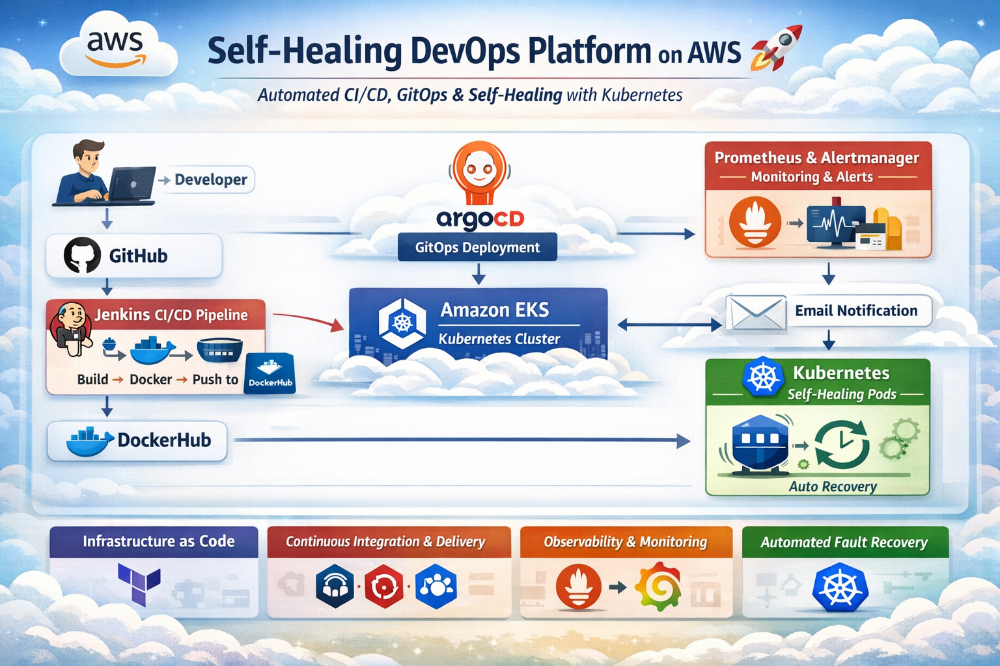

# Self-Healing DevOps Platform 🚀

A complete **Self-Healing DevOps Platform** built on AWS that automates CI/CD, GitOps deployment, monitoring, and auto-recovery using Kubernetes. This project demonstrates real-world DevOps practices including Infrastructure as Code, continuous delivery, observability, and fault recovery.

---

## 📌 Project Overview

This platform automatically builds, deploys, monitors, and heals applications running on a Kubernetes cluster. If an application or node fails, Kubernetes reschedules workloads, while monitoring tools detect issues and alert the system.

---

## 🏗 Architecture Diagram



```
Developer → GitHub → Jenkins (CI Pipeline)
           ↓
      Docker Image → DockerHub
           ↓
 ArgoCD (GitOps) → Kubernetes (EKS)
           ↓
 Prometheus Monitoring + Alertmanager
           ↓
   Email Alert Notification
           ↓
 Kubernetes Self-Healing (Pod Recreation)
```

---

## ⚙️ Tools & Technologies Used

| Category               | Tools                                   |
| ---------------------- | --------------------------------------  |
| Cloud                  | AWS (VPC, EC2, EKS, IAM, S3)            |
| Infrastructure as Code | Terraform                               |
| CI/CD                  | Jenkins, GitHub                         |
| Containerization       | Docker, DockerHub                       |
| Kubernetes             | EKS, kubectl                            |
| GitOps                 | ArgoCD                                  |
| Monitoring             | Prometheus                              |
| Alerting               | Alertmanager (Email Notifications)      |
| Package Manager        | Helm                                    |

---

## 🚀 Deployment Steps

### 1️⃣ Clone Repository

```
git clone https://github.com/dinshpatil5615/Self-Healing-Platform.git
cd self-healing-platform
```

### 2️⃣ Provision Infrastructure using Terraform

```
cd terraform
terraform init
terraform apply
```

This creates:

* VPC with public subnet
* Internet Gateway & Route Table
* EC2 Jenkins Server
* EKS Cluster with worker nodes

---

### 3️⃣ Setup Jenkins CI Pipeline

* Access Jenkins: `http://<jenkins-public-ip>:8080`
* Install suggested plugins
* Create pipeline to:

  * Build application
  * Create Docker image
  * Push image to DockerHub

---

### 4️⃣ Setup ArgoCD (GitOps)

```
kubectl create namespace argocd
kubectl apply -n argocd -f https://raw.githubusercontent.com/argoproj/argo-cd/stable/manifests/install.yaml
```

* Access ArgoCD UI
* Connect GitHub repo
* Sync application manifests

---

### 5️⃣ Deploy Application on Kubernetes

* ArgoCD automatically deploys manifests
* Kubernetes manages pods and services

---

### 6️⃣ Setup Monitoring

```
helm repo add prometheus-community https://prometheus-community.github.io/helm-charts
helm install monitoring prometheus-community/kube-prometheus-stack
```

* Prometheus to monitor Kubernetes pods
* Alert rule for Pod Restart detection
* Alertmanager to send Email notifications

📊 Self-Healing Workflow
1. Application pod is running
2. Pod is manually deleted (failure simulation)
3. Kubernetes recreates the pod automatically
4. Prometheus detects pod restart
5. Alertmanager sends email notification
---

## 🔐 Security Approach

* IAM roles for EKS cluster and nodes
* Security Groups restrict inbound ports (22, 8080, 3000)
* Kubernetes RBAC enabled
* No hardcoded secrets (use Kubernetes Secrets)
* Secrets managed via Kubernetes Secrets

---

## 🧠 Key Learning Outcomes

* Infrastructure automation using Terraform
* CI/CD with Jenkins
* Docker image build & push automation
* GitOps using ArgoCD
* Kubernetes orchestration and self-healing
* Monitoring with Prometheus
* Alertmanager email alert integration
* Real-world troubleshooting experience

---

## 📂 Project Structure

```
self-healing-platform/
│
├── terraform/          # Terraform IaC files
├── jenkins/            # Jenkins pipeline files
├── kubernetes/         # K8s manifests
├── argocd/             # GitOps application config
├── monitoring/         # Prometheus configs
└── README.md
```

---

## 💡 Future Enhancements

* Add Slack / WhatsApp alert notifications
* Add Horizontal Pod Autoscaler (HPA)
* Implement Blue-Green or Canary deployments
* Add Terraform remote state
* Add Grafana dashboards for visualization

---

## 👨‍💻 Author

**Dinesh Patil**
DevOps Engineer (Fresher)

---

⭐ If you found this project helpful, give it a star on GitHub!
